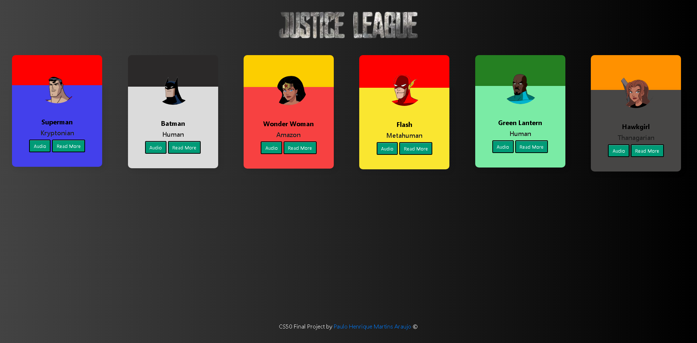
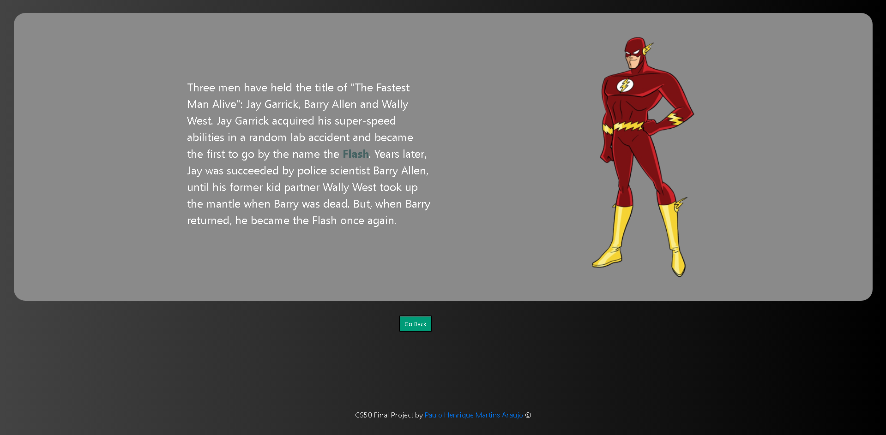

# Justice League Lineup

  

  

> This is a prototype for a web page that shows the Justice League lineup, alongside a sound of a quote from each member and they're backstory.

### Improvments

  

	I'm gonna continue working on this project and these are some new improvmentes I think would be great:

- [x] Create the first prototype.
- [ ] Implement new heroes.
- [ ] Clean source code and change the name of the classes.
- [ ] Responsive web design for mobile.
- [ ] Figure out an easier way to implement new heroes (maybe use a Framework).
- [ ] Use the index.html to input new TV Shows I enjoy, like Avatar: The Last Air Bender.

  

## 💻 Before starting

  

Please, before starting, check out if everything is correct on this list:

* You ajusted the volume to listen without any damage.

* You are using a PC (this prototype is not responsive yet)

  

## 📫 If you'd like to change something:

You are welcome to help out with any changes you'd like, please let me know so we can discuss :)

  

## 🤝 Made by:

 

<b>Paulo Henrique</b>

